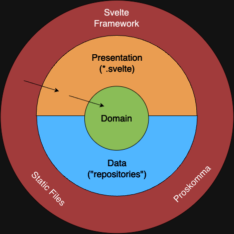
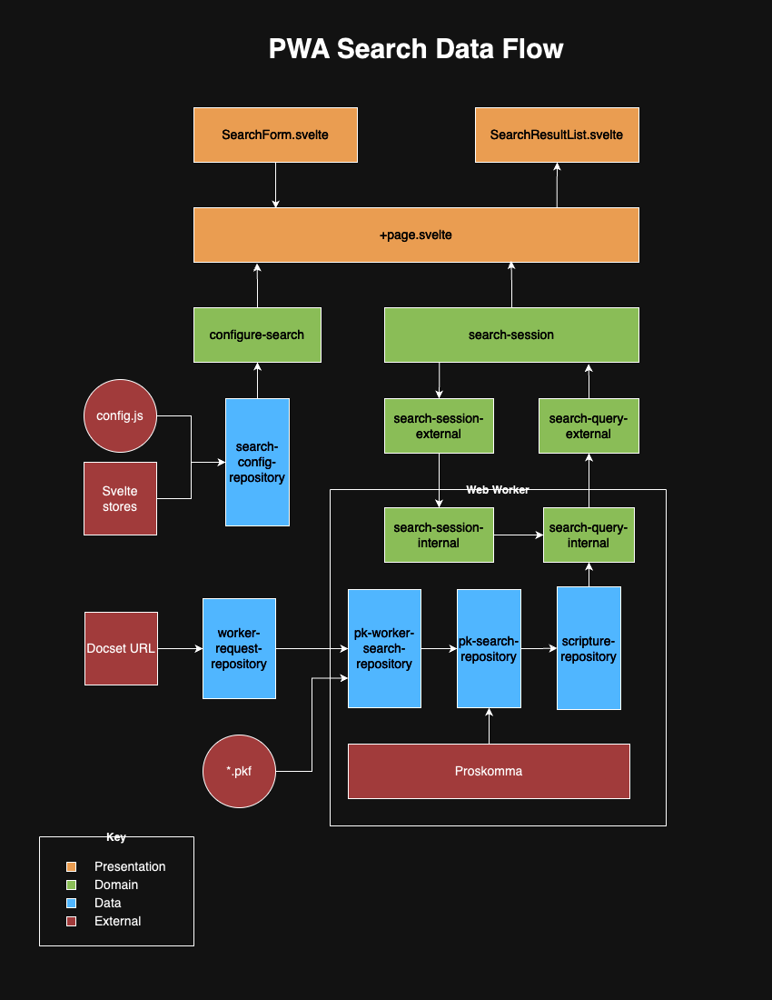

# Search Overview

This document gives an overview of the search implementation in SAB PWA.

## Diagrams

The diagrams in this document were produced using a free web app called
[draw.io](https://app.diagrams.net/). Please keep them up to date by editing
`./pwa-search.drawio` using the online editor.

## Architecture

The structure of the search code borrows heavily from
[Clean Architecture](https://blog.cleancoder.com/uncle-bob/2012/08/13/the-clean-architecture.html).

There are two main reasons for adopting this structure:

-   To make it easy to write unit tests
-   To isolate "core" code from dependencies that may change in the future

As the following diagram shows, the code is divided into four layers:

-   **Domain**: The core logic of the search feature. This layer attempts to be agnostic
    of all the outer layers. Ideally, it should only change if the functionality of search changes.
-   **Data**: Interacts with external data sources (ex: Proskomma, static files). This layer is
    responsible for converting data from its "raw" form (ex: a GraphQL response from Proskomma) to the
    form most convenient for the domain layer.
-   **Presentation**: Like the data layer, but interacts with the Svelte UI. This code resides entirely
    within the `*.svelte` components.
-   **Externalities**: Includes Proskomma, files exported from SAB, and the Svelte framework itself.
    If any of these were to change, it should only affect the data and presentation layers (ideally).

## Factory Files

[Dependency Injection](https://en.wikipedia.org/wiki/Dependency_injection) is a common design pattern within the
search code. With dependency injection, classes depend on abstract interfaces instead of concrete implementations.
The implementations are then passed to the class through constructor arguments.

The `search/` and `search-worker/` directories both have `factories.ts` files responsible for constructing objects
with appropriate dependencies. This may be a good place to start if you're trying to figure out how the search classes
fit together.

## Data Flow

The following diagram shows how data flows through various components during a search.

Here is a summary of the search process:

-   When the user submits a search using the `SearchForm` Svelte component, `configure-search.ts` combines data from the
    UI with data parsed from `config.js` and other sources, yielding a set of configuration options for `search-session.ts`.
-   `search-session.ts` creates a new search query
    -   The request for a new query gets sent to the web worker (see below)
    -   If necessary, the worker fetches the frozen docset file using a URL provided by the window. This file is loaded into
        Proskomma.
-   `search-session.ts` runs the query to completion
    -   The worker begins the search by sending GraphQL requests to Proskomma.
    -   Each GraphQL response is parsed and filtered into search results, which are sent back to `search-session.ts`
-   As results come in, `search-session.ts` sends them one-by-one to the Svelte UI for display.

## Saved Results

After running a search query, the app saves the results in `localStorage` and adds a `savedResults` query parameter to the
current URL. If the page is reloaded with this query parameter, the app will load the saved search results and return to the
last scrolled position.

If the user clicks on a search result and then taps the back button (the browser back button or the Android back button), the
`savedResults` parameter will still be in the URL, and the app will load saved results. This makes it easier to navigate between
multiple search results.

## Web Worker

Search involves several long operations that can block for several seconds. If these operations were run in the window (the "main"
thread), the app would freeze.

To prevent this, most of the search takes place in a dedicated
[web worker](https://developer.mozilla.org/en-US/docs/Web/API/Web_Workers_API/Using_web_workers), which runs on its own thread.

### Messenger API

Web workers communicate with the window through [message events](https://developer.mozilla.org/en-US/docs/Web/API/Web_Workers_API/Using_web_workers#sending_messages_to_and_from_a_dedicated_worker).
Message events act as one-way signals from the window to the worker or vice-versa.

As more features became delegated to the web worker, it became desirable to support two-way communication in a
call/return format. (By analogy, think function calls vs. goto statements.) To make this interaction easier, a simple
Messenger API was built. The Messenger allows the window to send asynchronous requests to the worker and vice-versa.
The response can be obtained using the `await` keyword, just like any other asynchronous function call.

For more information about the Messenger class, see the inline documentation at `src/lib/utils/worker-messenger/`.

### Limitations

Some operations can't be performed in a web worker, including the following:

-   A web worker can't access `localStorage`. In fact, it can't even import a file that refers to `localStorage` without
    throwing a `ReferenceError`. This prohibits the worker from importing some of the Svelte stores, which is why
    `configure-search` must be run in the window.
-   Web workers have special issues when constructing relative URLs:

    -   When the [fetch](https://developer.mozilla.org/en-US/docs/Web/API/fetch) function receives a relative URL, it
        expands it to an absolute address by appending it to some base URI. The base URI is different in a worker context than
        in a window context. In order for `fetch` to behave the same in a web worker as it would in the window, it will
        need to be invoked as follows:

            fetch(new URL('/static/example.json', base))

        where `base` is the window's `document.baseURI`.

    -   As of June 2024, vite could not resolve the import `base` from `$app/paths` in a web worker context (this was only
        apparent while running `vite build`). This may be a third-party bug that gets resolved in the future.

## Debugging GraphQL

Search uses GraphQL to get data from Proskomma. To test GraphQL queries interactively, launch the Data Sandbox by running
`npm run sandbox`. The sandbox will automatically load frozen docset files produced by the conversion process.

## Debugging Regex

Various parts of the search feature use regex. [RegExr](https://regexr.com/) is a helpful online tool for debugging these
expressions interactively.
